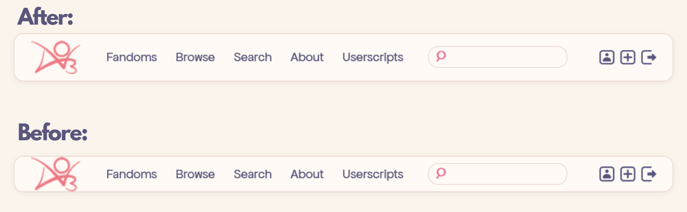
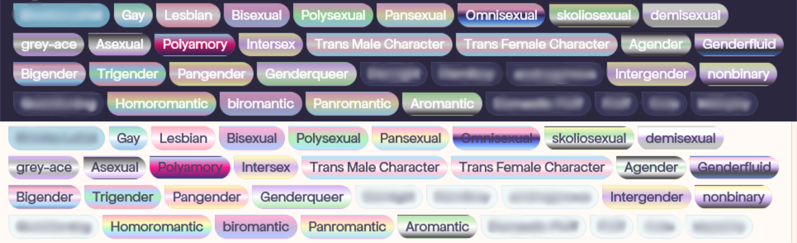
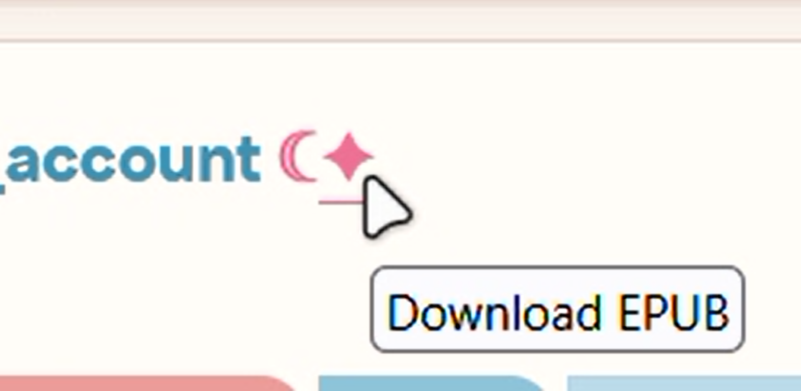

# AO3 Tweaks

A collection of CSS add-ons and userscripts to customize your AO3 experience.  

All CSS add-ons can work standalone, but for the full experience i recommend using [Rosé Pine AO3 skin](https://github.com/Wolfbatcat/ao3-rose-pine) by [@Wolfbatcat](https://github.com/Wolfbatcat) , as most of them are based on and designed to be complementary with this gorgeous site skin 

this is mostly self indulgent but i thought i might share in case anyone would find anything here helpful

> **Note:** My personal edits to Rosé Pine skin: [AO3 Rosé Pine — Closer to Home] lives in a separate Fork // will link it here//

----------

## Contents

-   [Installation](#installation)
    -   [AO3 Site Skin (CSS)](#ao3-site-skin-css)
    -   [Stylus (CSS)](#stylus-css)
    -   [Userscripts (JS via Greasyfork)](#userscripts-js-via-greasyfork)
-   [Add-ons](#add-ons)
    -   [Hide Inactive Navigation Buttons](#hide-inactive-navigation-buttons)
    -   [AO3 Logo in Header](#ao3-logo-in-header)
    -   [Header Padding](#header-padding)
    -   [LGBTQ+ Color-Coded Tags](#lgbtq-color-coded-tags)
    -   [Custom Fonts for Mobile](#custom-fonts-for-mobile)
    -   [Platonic Ship Tags](#platonic-ship-tags---by-wolfbatcat)
    -   [Custom Fonts](#custom-fonts---by-wolfbatcat)
    -   [EPUB Download Button](#epub-download-button)
    -   [Bonus: Light/Dark toolbar toggle button for Zen & Firefox users](#bonus-lightdark-toolbar-toggle-button-for-zen--firefox-users)

----------

## Installation
  
  ### AO3 Site Skin (CSS)

  You can paste them directly into an AO3 site skin:

  1.  Log into AO3 and go to **Dashboard → Skins → My Site Skins → Create Site Skin**
  2.  Give it a name, then paste the CSS into the **CSS** field
  3.  Click **Create** and then **Use** to activate it
  4.  To stack multiple snippets, either combine them into one skin or use AO3's **parent skin** feature to layer skins on top of each other

  > Some snippets on this list are marked **(Stylus only)** — AO3's skin editor restricts certain CSS features like `@font-face`, so those need to be applied through Stylus instead.

  ----------

  ### Stylus (CSS)

  [Stylus](https://github.com/openstyles/stylus) is a browser extension that lets you inject CSS into any website, bypassing AO3's skin restrictions.

  1.  Install Stylus for [Firefox](https://addons.mozilla.org/en-US/firefox/addon/styl-us/) or [Chrome](https://chrome.google.com/webstore/detail/stylus/clngdbkpkpeebahjckkjfobafhncgmne)
  2.  Click the Stylus icon in your browser toolbar (or extensions menu)
  3. Navigate to the gear icon `⚙️` **Options/Settings**→ Look for a plus icon `➕`  **Write new style**
  4.  Paste the CSS and click **Save**

  > On mobile, Stylus is available through **Firefox for Android**. Other mobile browsers may not support extensions.

  ----------

  ### Userscripts (JS via Greasyfork)

  Userscripts require a script manager extension to run.

  1.  Install [Tampermonkey](https://www.tampermonkey.net/) (or any script manager) for your browser
  2.  Go to the script's [Greasyfork](https://greasyfork.org/en/users/1565271-merna) page (linked in the relevant section below) and click **Install**
  3.  Confirm the installation prompt

  > On mobile Firefox, Tampermonkey is available as an add-on and works the same way.
  ----------

## Add-ons

### Hide Inactive Navigation Buttons

[`add-ons/CSS/hide-useless-nav-buttons.css`](add-ons/CSS/hide-useless-nav-buttons.css) · **AO3 Skin**

Hides the unclickable previous/next pagination buttons that appear when there's no page to navigate to.

A small quality-of-life tweak that keeps the interface looking clean.

----------

### AO3 Logo in Header

[`add-ons/CSS/only-logo-in-header-Colored.css`](add-ons/CSS/only-logo-in-header-Colored.css) · **AO3 Skin**

Removes the "
Archive of Our Own" text and keeps the AO3 logo to the header and recolors it to match the [Rosé Pine skin](https://github.com/Wolfbatcat/ao3-rose-pine) palette. 

Works as a standalone snippet if you're using a different theme but still want the logo back.

----------

### Header Padding

[`add-ons/CSS/header-padding(stylus).css`](add-ons/CSS/header-padding(stylus).css) · **Stylus only**
>Complementary to [AO3 Logo in Header](#ao3-logo-in-header)
>
Adds a little breathing room to the header bar so it sits more comfortably on desktop and wider screens.

Applied via [Stylus](#stylus-css) because it pairs with layout-level adjustments that work better outside AO3's skin system.

----------

### LGBTQ+ Color-Coded Tags

[`add-ons/CSS/lgbt-tags/`](add-ons/CSS/lgbt-tags/) · **AO3 Skin**

Assigns colors inspired by pride flags to their corresponding tags, making them visually distinct at a glance while browsing. 

> **any** related tag will be color coded with it's corresponding flag colors, the CSS is very detailed and hopefully covers any LGBTQ+ related tag as it includes up to **30 Orientations**, *the showcased example in the preview below doesn't cover all of them*

Comes in two versions:

-   [**`lgbt-tags-light.css`**](add-ons/CSS/lgbt-tags/lgbt-tags-light.css) — for light themes
-   [**`lgbt-tags-dark.css`**](add-ons/CSS/lgbt-tags/lgbt-tags-dark.css) — for dark themes

----------

### Custom Fonts for Mobile

[`add-ons/CSS/custom-fonts(stylus).css`](add-ons/CSS/custom-fonts(stylus).css) · **Stylus only**

mobile devices are very limited regarding font options, that's why your custom font doesnt apply on your mobile, because AO3's skin editor doesn't support `@font-face`, which is needed to load custom fonts. 

This snippet lets you load any font using its host URL (from Google Fonts, GitHub, etc.) through Stylus instead.
>the CSS includes all Fonts recommended by [@Wolfbatcat](https://github.com/Wolfbatcat) in the [Rosé Pine Site Skin instructions](https://archiveofourown.org/works/69993411).
>
*— Works on desktop too if you [don't have the font installed](#️make-sure-your-chosen-fonts-are-installed-on-your-device)*
#### how to get your font URL:
the easiest method is through GitHub,

 simply search up the font name and see if the font designer is hosting it on github (which is most likely), otherwise you can host the font yourself if you want.

 1. navigate to the font file on the GitHub repo and copy its link ..

      this should be the URL structure:

      `https://github.com/[user]/[repo]/blob/[branch]/[path]`
      
    ***note:** preferably chose the font file that ends with `.woff2` as this is the web font format and its most effecient for websites*

 2. next you **must** convert the URL into a [JSDelivr](https://www.jsdelivr.com/) CDN link for it to work
    - you can simply paste the file URL you copied to [this tool](https://dt.in.th/GitHubToJSDelivr) where it will convert it into a JSDelivr URL

    >or if you wanna do the hardwork yourself, you can manually do it as well.
    >
    >only do these three changes to the URL :
    >1.  Replace `github.com` with `cdn.jsdelivr.net/gh`
    >2.  Replace `/blob/[branch]/` with `@[branch]/`
    >3.  Keep everything after that the same

    Either way the output should look like this:

    FROM: `https://github.com/[user]/[repo]/blob/[branch]/[path]`

    TO:   `https://cdn.jsdelivr.net/gh/[user]/[repo]@[branch]/[path]`

>**Alternatively**, [Fontonic](https://addons.mozilla.org/en-US/android/addon/fontonic/) add-on can change fonts without Stylus, but its font selection is quite limited and it loads noticeably slower. 
>
>The Stylus method is recommended — all you need is the font's [CSS URL](#how-to-get-your-font-url) from your font host, and trust me it's worth the effort.

----------

### Platonic Ship Tags - By [@Wolfbatcat](https://github.com/Wolfbatcat)

[`add-ons/CSS/Platonic-tags/`](add-ons/CSS/Platonic-tags/) · **AO3 Skin**

Included in the [Rosé Pine Site Skin instructions](https://archiveofourown.org/works/69993411), 

defferentiates platonic relationship tags (X`&`Y) with their own custom color, and it's a must-have in my opinion, especially along with [AO3: Reorder Ship Tags](https://greasyfork.org/en/scripts/562812-ao3-reorder-ship-tags) script

-   [**`Platonic-tags-light.css`**](add-ons/CSS/Platonic-tags/Platonic-tags-light.css) — for light themes
-   [**`Platonic-tags-dark.css`**](add-ons/CSS/Platonic-tags/Platonic-tags-dark.css) — for dark themes

>ALL CREDITS TO [@Wolfbatcat](https://github.com/Wolfbatcat)

----------

### Custom Fonts - By [@Wolfbatcat](https://github.com/Wolfbatcat)

[`add-ons/CSS/Custom-fonts/custom-fonts.css`](add-ons/CSS/Custom-fonts/custom-fonts.css) · **AO3 Skin**

Extracted from the [Rosé Pine Site Skin CSS](https://github.com/Wolfbatcat/ao3-rose-pine), 

sets custom site, headings, code, and work fonts.
(i wanted to have it as a separate skin just because i am lazy and don't want to modify my custom fonts on every update of the skin)

#### ⚠️MAKE SURE YOUR CHOSEN FONTS ARE INSTALLED ON YOUR DEVICE

1. *download the font*
2. *right-click the file (TTF or OTF)*
3. *select **Install** or **Install for all users**.*

*if you are on mobile you have to apply [Custom Fonts for Mobile CSS](#custom-fonts-for-mobile) for your fonts to show up there*
>ALL CREDITS TO [@Wolfbatcat](https://github.com/Wolfbatcat)
----------

### EPUB Download Button

[`add-ons/JavaScript/EPUB-Download-Buttons/`](add-ons/JavaScript/EPUB-Download-Buttons/) · [**Greasyfork**](https://greasyfork.org/en/users/1565271-merna)

Adds a convenient EPUB download button directly on blurbs so you don't have to go through the full work page then the download menu. it's simply there while you are browsing.

Two versions available:

- **V2 - Next to Work Titles** *— recommended*

  **Button appears next to work titles** (after author names)
    -   Works beautifully with [AO3: Chapter Shortcuts](https://greasyfork.org/en/scripts/549571-ao3-chapter-shortcuts)
    -   Button positions itself after any existing buttons

   

-   **V1 - Bottom-Left Corner** *— kept for anyone who prefers this style* (looks better on desktop)

    **Button appears at bottom-left** of work blurbs

    

----------
## Bonus: Light/Dark toolbar toggle button for Zen & Firefox users

A toolbar button i made for my Zen Browser that toggles website dark/light appearance with a single click using the built-in color-scheme preference in the browser settings.

If your skin has the `prefers-color-scheme` feature that switches the site appearance from light to dark mode according to your OS preference, you're in the right place.

**[you can find all the instructions and everything about how to set it up, here](https://github.com/ravenothere/Zen-Site-Appearance-Toggle)**

works on any website that supports this feature but honestly i made it mainly for the sole purpose of enhancing my AO3 experience even more,

>*i am a light-mode girl but i love the skin's dark mode alot too and i wanted to enjoy it as much, and was lowkey bugged by having to go through the settings and navigate to the option to toggle the site appearance everytime,*
>
>*and i thought 'cant i just turn all that into a button or something that is easier to access?!' that is when i set my mind into it.*

 **note:** if THE GIF preview above makes it look slower, i assure you it's not, this is just GIF being GIF, it's a very fast and light button, enjoy.

## Credits

All snippets here are my own additions or modifications unless otherwise noted.  

i wouldn't have been inspired to do any of this if it weren't for discovering [@Wolfbatcat](https://github.com/Wolfbatcat)'s AO3 [skin](https://github.com/Wolfbatcat/ao3-rose-pine) and [scripts](https://greasyfork.org/en/users/1498004-blackbatcat), go throw him flowers for all the amazing work he did 

>*i genuenly had to start teaching myself how to edit and use CSS and JavaScript just for the sake of this newly discovered AO3 wellbeing,..
a couple weeks ago i had near zero knowledge on how to navigate any code in general, but once i realized i CAN actually customize my OWN desired experience nothing could stop me anymore.*

**Featured in the showcase preview:**
- [Rosé Pine AO3 site skin](https://github.com/Wolfbatcat/ao3-rose-pine) — *obviously duh*
- [AO3: Chapter Shortcuts](https://greasyfork.org/en/scripts/549571-ao3-chapter-shortcuts)
- [AO3: Reading Time & Quality Score](https://greasyfork.org/en/scripts/549777-ao3-reading-time-quality-score)

**Other Scripts i'm also using (100%recommend)**:
- [AO3: Advanced Blocker](https://greasyfork.org/en/scripts/549942-ao3-advanced-blocker) — *VERY VERY customizable blocker for literally anything on the website, heals my OCD brain to the core, very beautiful and clean UI, basically a chef kiss*
- [AO3: Reorder Ship Tags](https://greasyfork.org/en/scripts/562812-ao3-reorder-ship-tags) — *reorders ship tags so all platonic ships are placed at the end of the relationship tag order, for more organized and neat look*
- [AO3: Quick Hide](https://greasyfork.org/en/scripts/564383-ao3-quick-hide) — *very convenient script that lets you hide-or more like collapse- works or comments, you can control the visability of the collapsed item which is so satisfying for some reason, i use it to hide fics that i've already read or downloaded* 
- [AO3: Skin Switcher](https://greasyfork.org/en/scripts/551820-ao3-skin-switcher) — *tho i no longer switch my skins much anymore but its a very helpful shortcut that saves you the bother of navigating to your skins page, either to edit or set different skins*
- [AO3: Site Wizard](https://greasyfork.org/en/scripts/550537-ao3-site-wizard) — *so basically that is all in one skin editor at your hands, you can customize the site's fonts colors, work formatting, very straightforward and easier UI for simple skin customizations*